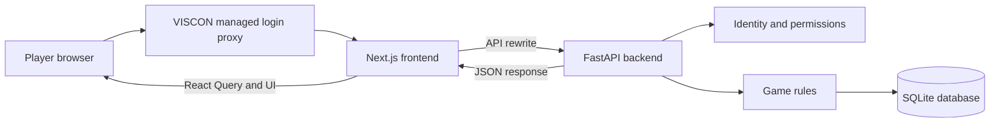
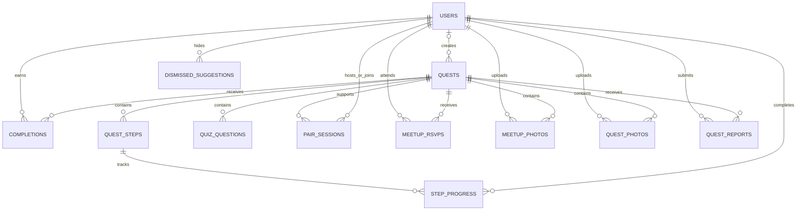

# Campus Voyager — the complete codebase guide

Source snapshot: 10 October 2026. This guide explains the application currently in `Hackathon_Team_19`, including the newer visual components, partner invitations, and badge progress. It describes what the source implements; it is not a claim that every flow was tested in production.

All paths below are relative to the repository root, `Hackathon_Team_19/`. The guide covers application source, generated API code, configuration, tests, assets, and deployment. Installed third-party libraries and generated build output are explained by their role rather than reproduced line by line.

## Contents

1. [What the application does](#1-what-the-application-does)
2. [Architecture and request flow](#2-architecture-and-request-flow)
3. [Repository structure](#3-repository-structure)
4. [Backend startup and database](#4-backend-startup-and-database)
5. [Identity and maintainer permissions](#5-identity-and-maintainer-permissions)
6. [Database models and relationships](#6-database-models-and-relationships)
7. [API schemas](#7-api-schemas)
8. [Shared game rules](#8-shared-game-rules)
9. [Backend routers and all endpoints](#9-backend-routers-and-all-endpoints)
10. [Built-in quests, badges, and hobbies](#10-built-in-quests-badges-and-hobbies)
11. [Frontend foundations and API clients](#11-frontend-foundations-and-api-clients)
12. [Every frontend page](#12-every-frontend-page)
13. [Shared frontend components](#13-shared-frontend-components)
14. [Quest action components](#14-quest-action-components)
15. [Maintainer interface and quest editor](#15-maintainer-interface-and-quest-editor)
16. [Map implementation](#16-map-implementation)
17. [Visual design system](#17-visual-design-system)
18. [Complete feature walkthroughs](#18-complete-feature-walkthroughs)
19. [Development and deployment](#19-development-and-deployment)
20. [Tests and verification](#20-tests-and-verification)
21. [Where to make changes](#21-where-to-make-changes)
22. [Implementation boundaries](#22-implementation-boundaries)
23. [Glossary and suggested reading order](#23-glossary-and-suggested-reading-order)

## 1. What the application does

Campus Voyager turns exploring ETH campus and meeting other participants into small quests. Each player has persistent progress, points, achievement badges, optional hobbies, and optional connection suggestions.

There are five quest types:

| Internal type | Player experience | Completion rule |
| --- | --- | --- |
| `solo` | Do an activity independently | Confirm completion, submit a claim for maintainer approval, enter a printed code / scan its QR, or enter a creator-set password, depending on the quest |
| `pair` | Do an activity with another player | One hosts a code; a different player joins it |
| `quiz` | Answer multiple-choice questions | Every answer must be correct |
| `multi_step` | Work through ordered activities | Complete the steps in order; the last step completes the quest |
| `meetup` | Attend a scheduled campus event | Check in during the allowed time window |

Printed verification is optional for solo quests and meetups. A maintainer chooses the completion method and prints a sign containing the quest's permanent code and a QR link. On a code-verified quest, players can enter the printed code or scan the sign from the quest screen with the in-app ZXing WASM scanner. A phone's camera app can still open the printed link, and the web app submits its code automatically. For a meetup it replaces the "I'm here" button: the organiser brings the printed sign and players scan it to check in, still only during the check-in window. This is separate from the temporary codes used to join pair quests.

Password verification is another solo completion method. A creator sets a 1–40 character password and shares it with players after they finish the activity. The backend stores a salted password hash; admin and player responses never return the password. Maintainers can replace it by entering a new one when editing. Password quests have no QR scanner.

Players can immediately publish solo, pair, quiz, and multi-step quests. Player-created solo quests require a password, and every player-created quest awards 10 points. Meetups and subsequent editing or retirement remain maintainer-only. Players can report inappropriate quest content; maintainers can resolve reports and review completion claims.

The backend owns identity, permissions, completion eligibility, and scoring. The frontend presents those rules and asks the backend to perform actions. The browser does not decide how many points a player receives.

## 2. Architecture and request flow

### 2.1 The stack

| Layer | Technology | Role |
| --- | --- | --- |
| Web application | Next.js `16.4.0`, React `19.3.0`, TypeScript | Routes, screens, forms, and browser interactions |
| Frontend data handling | TanStack React Query `^5.104.1` | Fetches, caches, refetches, and mutates server data |
| Styling | Tailwind CSS `^4`, CSS variables | Layout and reusable design tokens |
| Icons | Lucide React `^1.54.0` | Consistent SVG icons |
| Map | Leaflet `^1.9.4` and OpenStreetMap tiles | Campus locations and optional device location |
| QR rendering | `qrcode.react` `^4.2.0` | Printable SVG for a quest's redemption link |
| QR reading | `zxing-wasm` `^3.1.5` | In-browser QR decoding from the player's camera |
| Backend | FastAPI and Uvicorn | HTTP API and request validation |
| Persistence | SQLAlchemy 2 and SQLite by default | Players, quests, progress, reviews, and sessions |
| API generation | FastAPI OpenAPI and Orval `^8.41.0` | Shared contract and frontend hooks |
| Deployment | Docker Compose and GitHub Actions | Build and run both services on the deployment server |

Frontend versions above come from `frontend/package.json`. Backend dependencies use minimum versions rather than a fully pinned lockfile.

### 2.2 How a request travels



On the deployed site, the managed proxy authenticates the player and forwards identity headers. The application itself does not implement Switch edu-ID login.

The browser calls a same-origin address such as `/api/quests`. `frontend/next.config.ts` rewrites it to the backend's `/quests` endpoint:

```text
Browser: http://localhost:3000/api/quests
    → Next.js rewrite
    → http://localhost:8000/quests during development

Deployed frontend: /api/quests
    → Next.js rewrite
    → http://backend:8000/quests inside Docker
```

The backend's `root_path="/api"` describes its external mounting prefix for FastAPI and OpenAPI. It does not mean that every backend route is internally declared with `/api`.

### 2.3 How a screen gets updated

1. A page calls a generated hook, such as `useListQuests()`.
2. React Query runs the generated `fetch()` function and caches its result.
3. The page checks loading state, network failure, and the HTTP response status.
4. A player action runs a mutation, such as `useCompleteQuest()`.
5. The backend validates the action and writes the result.
6. `useAction().refreshAll()` invalidates cached queries. Active queries refetch; inactive queries are marked stale.
7. Quest progress, points, badges, and ranking can now reflect the same saved result.

There is no separate browser-side points ledger, WebSocket service, or background task queue.

## 3. Repository structure

```text
Hackathon_Team_19/
├── READ.md                         Project-specific setup and game notes
├── CODEBASE_GUIDE.md                This document
├── docker-compose.yml              Runs frontend and backend
├── .github/workflows/deploy.yml     Deploys pushes to main
├── backend/
│   ├── main.py                     FastAPI application and startup
│   ├── database.py                 Engine, sessions, legacy schema upgrade
│   ├── auth.py                     Proxy identity and maintainer checks
│   ├── models.py                   SQLAlchemy database tables
│   ├── schemas.py                  API request and response models
│   ├── game.py                     Shared scoring and game rules
│   ├── badges.py                   Achievements (computed, friend badge stored)
│   ├── hobbies.py                  Fixed hobby catalog
│   ├── friendships.py              Friend request rules and friends view
│   ├── routers/
│   │   ├── __init__.py             Empty package marker
│   │   ├── players.py              Profile, hobbies, badges
│   │   ├── quests.py               Quest play, creation, RSVP, reports
│   │   ├── pair.py                 Partner codes, invitations, joins
│   │   ├── friends.py              Friend requests and friends list
│   │   ├── social.py               Shared-interest suggestions
│   │   ├── leaderboard.py          Ranking calculation
│   │   └── admin.py                Maintainer operations
│   ├── tests/
│   │   ├── conftest.py             Isolated test database and client
│   │   ├── test_api.py             Identity and core scoring tests
│   │   ├── test_features.py        Expanded feature tests
│   │   └── test_code_verification.py  Stable-code and redemption tests
│   ├── requirements.txt            Runtime dependencies and autopep8
│   ├── requirements-dev.txt        Adds pytest and httpx
│   ├── Dockerfile                  Python container
│   └── .gitignore                  Excludes local DB and Python artifacts
└── frontend/
    ├── app/                        Next.js routes and root UI
    ├── src/components/             Reusable UI and quest actions
    ├── src/lib/                    API clients and shared helpers
    ├── public/                     Starter SVG assets
    ├── package.json                JavaScript dependencies and commands
    ├── package-lock.json           Exact dependency resolution for npm ci
    ├── next.config.ts              API rewrites and Next.js configuration
    ├── orval.config.ts             Frontend API code generation
    ├── tsconfig.json               TypeScript configuration
    ├── eslint.config.mjs           Lint configuration
    ├── AGENTS.md                   Instructions for coding agents
    ├── README.md                   Starter Next.js documentation
    ├── Dockerfile                  Frontend build and production container
    └── .gitignore                  Excludes dependencies and build output
```

The workspace also contains `MVP.md`, `EXTRA_FEATURES.md`, and an outer `READ.md`. Those are planning or older setup documents, not executable application code. The current app implements substantially more than the original solo MVP specification. `review/` contains browser-review screenshots; the app does not load them.

## 4. Backend startup and database

### 4.1 `backend/main.py`

This is the backend entry point used by `uvicorn main:app`.

- Importing `models` registers SQLAlchemy's table definitions with `Base.metadata`.
- The FastAPI lifespan function calls `ensure_schema()` to create missing tables, archive pre-username tables, and backfill stable verification codes on current-schema quests.
- It does not insert any quests: a fresh database has none until a maintainer creates one.
- It includes the four router modules (players, quests, pair, admin).
- `GET /` returns `{"message": "Hello World"}` as a basic health endpoint.
- CORS is configured broadly with all origins, methods, and headers allowed, plus credentials. The normal frontend path still uses the same-origin Next.js rewrite.

`use_function_name()` gives OpenAPI operations readable names based on their Python function names. Orval can therefore generate `useListQuests` rather than a name containing the route and method.

Startup creates missing tables but adds no content and does not reset players or completions.

### 4.2 `backend/database.py`

`DATABASE_URL` is read from the environment. Without it, SQLite is stored at `backend/users.db`, resolved relative to the backend source directory rather than the shell's current directory.

`engine` is the shared database connection factory. `pool_pre_ping=True` checks connections before reuse. SQLite uses `check_same_thread=False`, allowing connections to be used by the application's threaded request handling.

`SessionLocal` creates SQLAlchemy sessions with automatic flushing and automatic commits disabled. Routers explicitly call `commit()`, `flush()`, or `rollback()` when needed.

`get_db()` supplies one session through FastAPI dependency injection and closes it after the request. FastAPI's dependency caching lets identity checks and route logic share the dependency within a request.

For SQLite, a connection event enables `PRAGMA foreign_keys=ON`. Foreign-key references are therefore enforced instead of being silently ignored.

### 4.3 Legacy schema upgrades

`create_all()` creates missing tables but does not add columns to existing tables. On startup, `ensure_schema()` archives pre-username tables as `legacy_*` and creates the current UUID and username schema. For an existing current-schema database, it adds code and password verification columns to quests if needed, assigns a random permanent code to code-verified rows missing one, and creates a unique code index. Later startups preserve the saved codes and password hashes.

This is a one-time compatibility step, not a versioned migration framework. Archived tables are retained; their rows are not imported into the new schema.

## 5. Identity and maintainer permissions

### 5.1 `backend/auth.py`

The backend reads two headers forwarded by the VISCON proxy:

| Header | Meaning |
| --- | --- |
| `X-User-Id` | Stable external identity; used to find the player |
| `X-User-Name` | Percent-encoded display name; decoded before use |

`_read_identity()` trims values and decodes the name. If no identity header is present and `DEV_USER_ID` is configured, it uses the development identity instead.

`get_current_player()` then:

1. Rejects a missing identity with HTTP `401`.
2. Limits the display name to 255 characters.
3. Finds the `User` by `username`, which is the `X-User-Id` value.
4. Creates one if it does not exist, using `Player` if no name is available.
5. Handles a simultaneous first request by rolling back a username conflict and fetching the row another request created.
6. Updates an existing display name when the proxy provides a new, non-empty name.

An authenticated read request can therefore create a player or update their name. The username is the user table's primary key, so users have no separate ID.

### 5.2 Maintainers

`MAINTAINER_IDS` is a comma-separated environment variable containing external identity values. `is_maintainer()` checks membership. `require_maintainer()` rejects other players with HTTP `403`.

The admin router applies this check to every endpoint. The frontend's `MaintainerOnly` component improves the UI, but server-side checks enforce permission.

Identity environment variables are read when the module is imported. Changing them requires restarting the backend process.

### 5.3 Deployment trust boundary

The app trusts identity headers because the managed proxy is expected to authenticate users and supply them. There is no password table, token validation implementation, or custom login form in this repository.

The deployment must ensure public traffic reaches the app through that trusted proxy and cannot inject a different identity. Compose binds the backend port to `127.0.0.1`, while the frontend is exposed on port 3000. The proxy setup itself is external to this repository. `DEV_USER_ID` is a local-development fallback and is not supplied by the deployment Compose file.

## 6. Database models and relationships

`backend/models.py` defines twelve tables. It uses SQLAlchemy's typed `Mapped` fields and `mapped_column()`. Relationships are represented by foreign keys; the code generally queries them explicitly rather than defining ORM `relationship()` collections.

| Class / table | Main fields | Why it exists |
| --- | --- | --- |
| `User` / `users` | `username` (primary key), `name`, `hobbies`, `discoverable` | Player identity and matching preferences |
| `Quest` / `quests` | Text, points, kind, status, coordinates, schedule, approval/code flags, permanent verification code, author, review note | Shared quest definition |
| `QuestStep` / `quest_steps` | Quest ID, position, title, description | Ordered multi-step content |
| `StepProgress` / `step_progress` | Player ID, step ID, completion time | Individual completed steps |
| `QuizQuestion` / `quiz_questions` | Quest ID, position, prompt, choices JSON, correct index | Quiz content and answer key |
| `Completion` / `completions` | Player ID, quest ID, status, awarded points, time, player note, review details | The authoritative completion and reward record |
| `PairSession` / `pair_sessions` | Quest, host, code, expiry, partner, completion time, cancellation, invitee | A two-player quest attempt |
| `MeetupRsvp` / `meetup_rsvps` | Player, quest, creation time | Intention to attend, separate from check-in |
| `MeetupPhoto` / `meetup_photos` | Meetup, uploader, media type, upload time | Event album photo; appears on checked-in players' profiles only while opted in |
| `QuestPhoto` / `quest_photos` | Quest, player uploader, media type, upload time | Player-uploaded photo from a completed meetup, pair, or multi-step quest |
| `QuestReport` / `quest_reports` | Player, quest, reason, time, resolved flag | Content moderation reports |
| `DismissedSuggestion` / `dismissed_suggestions` | Player and dismissed player | Persistent hiding of a suggestion |

### 6.1 Relationships



The diagram summarizes multiple user references on pair sessions and dismissed suggestions. A pair session can reference a host, a partner, and an invitee; only the host is required.

Every non-user entity has a UUID primary key. Foreign keys to users store the
username; foreign keys to quests and steps store UUIDs.

### 6.2 Constraints that protect saved data

| Constraint | Prevents |
| --- | --- |
| Primary key `User.username` | Multiple player records for one external identity |
| Unique `Quest.verification_code` | Two quests using the same printed code |
| Unique completion `(player_id, quest_id)` | Multiple reward records for the same player and quest |
| Unique step progress `(player_id, step_id)` | Saving one step twice for a player |
| Unique step/question `(quest_id, position)` | Duplicate positions inside one quest |
| Unique RSVP `(player_id, quest_id)` | Duplicate attendance intentions |
| Unique report `(player_id, quest_id)` | Multiple reports of the same quest by one player |
| Unique dismissal `(player_id, dismissed_player_id)` | Duplicate hidden-suggestion records |

`PairSession.code` is indexed but not declared unique. Code generation checks for a code already in use within its validity period; lookup chooses the newest matching session.

`Quest.verification_code` is different: a quest gets a random 12-character code when printed-code verification is enabled. The alphabet omits ambiguous characters. The code stays on the quest row through edits, player visits, and restarts. Only `requires_code` decides whether players must redeem it; ordinary edits do not regenerate the code. Existing code-verified rows are backfilled once as described in section 4.3. Password-verified quests instead store a salted hash in `password_hash`.

### 6.3 Points are derived, not stored on the player

The `User` table has no total-points column. Totals are calculated from approved `Completion.points_awarded` rows. This avoids a separate score counter drifting away from completion history.

Awarded points are a snapshot. Editing a quest from 10 points to 20 points does not change a previously approved 10-point completion. An approval-required claim starts at zero and receives the quest's points when a maintainer approves it.

### 6.4 Time representation

Database timestamps are naive UTC: UTC values stored without timezone metadata, because SQLite has no timezone-aware datetime type here.

- `utcnow()` creates the current UTC time in that format.
- `to_naive_utc()` converts an aware input into UTC before storage; naive input is assumed to already be UTC.
- `as_utc()` attaches UTC metadata for API serialization.
- Meetup displays explicitly use `Europe/Zurich`.
- Generic completed-at notes use the browser's locale and timezone.

## 7. API schemas

`backend/schemas.py` defines Pydantic request and response models. These validate input, limit what output exposes, and form the OpenAPI contract used to generate TypeScript types.

| Group | Models | Purpose |
| --- | --- | --- |
| Errors | `ErrorResponse` | A readable `detail` message |
| Profile | `Player`, `ProfileUpdate`, `HobbyOption`, `Badge` | Player summary, preferences, catalog, and achievement progress |
| Quest view | `QuestOut`, `StepOut`, `QuizQuestionOut` | Shared content plus the requesting player's progress |
| Playing | `CompleteRequest`, `CodeRedemption`, `CompletionResult`, `QuizSubmission`, `QuizResult`, `StepResult`, `RsvpResult`, `ReportRequest` | Player actions and results |
| Pairing | `PairSessionOut`, `PairStartRequest`, `PairJoinResult` | Code/session preview, optional invitee, and join result |
| Player creation | `PlayerQuestIn`, `CreatedQuestOut` | Published quest input and creator's quest list |
| Matching | `Suggestion`, `Suggestions` | Whether matching is enabled and the shared interests |
| Ranking | `LeaderboardEntry`, `Leaderboard` | Top entries plus the current player's own position |
| Admin content | `StepIn`, `QuizQuestionIn`, `AdminQuestIn`, `AdminQuizQuestionOut`, `AdminQuestOut`, `StatusChange` | Quest editing and publication |
| Admin review | `AdminCompletionOut`, `CompletionReview`, `AdminReportOut`, `ReportResolution` | Claim decisions and report handling |

`QuestOut` is personalized. The same quest can have `completed=true` for one player and `completed=false` for another. It includes step flags, approval state, the `requires_code` and `requires_password` flags, meetup state, RSVP count, current player's RSVP, and whether that player reported it. It never includes `verification_code` or `password_hash`. Maintainer-only `AdminQuestOut` includes the printed code when there is one, but never includes the password hash.

Player quiz responses contain choices but omit `correct_index`. Admin quiz responses include the answer key. Database records and player-facing API objects are deliberately different.

Some important validation limits:

- Player-created quest: trimmed title 2–120 characters; optional instructions up to 2000; optional location up to 255; fixed 10-point reward. Only solo, pair, quiz, and multi-step kinds are accepted; solo requires a nonblank password.
- Completion note: up to 500 characters; optional.
- Code or password redemption input: 1–40 characters. Printed codes are trimmed and uppercased; passwords are trimmed and case-sensitive. Admin input allows either method only for solo quests, one completion method at a time.
- Report reason: 5–500 characters before router trimming.
- Admin reward: 0–1000 points; publication requires at least 1.
- Coordinates: latitude −90 to 90; longitude −180 to 180.
- Editor payloads: at most 20 steps or 20 questions; quiz questions have 2–8 choices.
- `QuizQuestionIn.correct_answer_exists()` validates that the correct index refers to an existing choice.
- Profile updates contain at most 20 hobby keys; the router also verifies that every key belongs to the catalog.

Pydantic field checks and publication checks serve different purposes. A draft may satisfy its input schema while still being unready to publish.

## 8. Shared game rules

`backend/game.py` contains logic reused by several routers.

### 8.1 Scoring helpers

- `total_points()` sums approved awarded points, returning zero when there are none.
- `find_completion()` finds the unique player/quest record.
- `record_completion()` returns an existing record or creates one. Approved records receive quest points; pending records receive zero. It catches an insertion uniqueness conflict so simultaneous duplicate completions can return the winning row.
- `completion_result()` builds the response. A repeated request reports `already_completed=true` and `points_awarded=0` for that request, while the stored reward and total remain intact.

For example, two taps on a 10-point solo quest yield a saved total of 10 points, not 20. The second response can still say the quest is completed; it simply grants no new points.

### 8.2 Quest access and views

`get_playable_quest()` requires a published quest and optionally checks its type. An unpublished quest is unavailable for ordinary play.

`can_view()` permits a player to view a published quest, one they created, or a quest for which they have a completion record. This lets players retain access to relevant history even after retirement. Admins use separate admin endpoints to view all content.

`quest_views()` builds personalized `QuestOut` objects. Instead of querying every quest's related rows individually, it batches completions, steps, questions, progress, RSVPs, reports, and authors. It does not put quiz answer keys or printed verification codes in the player response.

`ordered_steps()` and `ordered_questions()` sort content by position. `done_step_ids()` supplies a player's saved step progress.

### 8.3 Meetup state

`CHECK_IN_EARLY` is 15 minutes. `meetup_state()` returns:

| State | Condition |
| --- | --- |
| `cancelled` | Quest has its cancellation flag set |
| `upcoming` | Before start minus 15 minutes, or missing scheduling data |
| `live` | From start minus 15 minutes through the end time, inclusive |
| `past` | After the end time |

The backend clock decides eligibility. The frontend displays the returned state rather than trusting its own clock to grant a reward.

### 8.4 Publication checks

`publish_problems()` returns reasons a quest cannot be published:

- Trimmed title must have at least 2 characters. Instructions may be empty.
- Reward must be at least 1 point.
- A map pin needs both coordinates or neither.
- A quiz needs at least one question, at least two non-empty choices per question, and a valid answer index.
- A multi-step quest needs at least two steps.
- A meetup needs a start and end, with end after start.

The admin UI displays these reasons. The backend enforces them again when publishing and when editing already published content.

### 8.5 IDs and errors

New entity IDs are UUIDs generated by SQLAlchemy. Built-in quest UUIDs are
deterministically derived from their original seed numbers, so seed runs keep
the same IDs. Databases with the old integer-keyed schema have their tables
archived as `legacy_*` before current tables are created. SQLite connections
wait up to 30 seconds for another writer.

`not_found()`, `conflict()`, and `bad_request()` standardize HTTP errors. `error_responses()` also declares error shapes in OpenAPI so generated clients can type them.

## 9. Backend routers and all endpoints

Paths in the following tables are backend paths. Browser requests normally add `/api`. For example, backend `/players/me` is browser `/api/players/me`.

Most game routes use `get_current_player`. `/admin` routes additionally require a maintainer. The root health endpoint and hobby catalog do not themselves require a player dependency.

### 9.1 `backend/routers/players.py`

| Method | Path | Function / behavior |
| --- | --- | --- |
| GET | `/players/me` | `get_me`: profile, computed points, badges, maintainer flag, preferences |
| PUT | `/players/me` | `update_profile`: validate and save hobbies and discoverability |
| GET | `/players/hobbies` | `list_hobbies`: return the fixed hobby catalog |

`player_out()` converts a database user into the public `Player` shape. External identity is not part of that response.

### 9.2 `backend/routers/quests.py`

| Method | Path | Function / behavior |
| --- | --- | --- |
| GET | `/quests` | `list_quests`: all published quests, ordered by creation, personalized |
| GET | `/quests/{quest_id}` | `get_quest`: a quest the player may view |
| POST | `/quests/{quest_id}/actions` | `act_on_quest`: `complete`, `redeem`, `quiz`, `step`, `rsvp`, `report`, `vote`, `pair_start`, or `pair_cancel` |
| POST | `/quests` | `create_quest`: immediately publish an allowed player quest; returns 201 |

`complete_quest()` rejects pair, quiz, and multi-step quests with instructions to use their dedicated mechanisms. It also rejects code- and password-verified quests, so the ordinary completion endpoint cannot bypass verification. For a meetup's first completion, it requires `live`. An existing meetup completion can be returned without awarding again after the window closes, provided the quest remains published.

The `vote` action (`{"type": "vote", "value": 1 | -1 | 0}`) stores one up/down vote per player on a player-created quest (`author_id` set); `0` removes it, the author cannot vote on their own quest, and maintainer-created quests reject votes. `QuestOut.votes` carries `up`, `down`, `score`, `mine` and `can_vote` for player-created quests and is `null` otherwise.

The `redeem` action accepts `{"type": "redeem", "code": "..."}` for a published, code-verified solo quest or meetup (for a meetup the live check-in window still applies, except for players who already checked in). `redeem_quest_code()` trims and uppercases input, rejects non-ASCII normalized values, checks it against that quest's saved code, and returns a readable 400 error for a mismatch without awarding points. A valid code calls `record_completion()`: multiple players can use the same sign, but each player/quest pair receives at most one reward. A repeat returns `already_completed=true` and zero newly awarded points.

The same `redeem` action accepts the password in its `code` field for password-verified solo quests. It compares a case-sensitive, trimmed password with the stored PBKDF2 hash. A mismatch awards no points; a match follows the same one-reward-per-player rule.

Approval-required solo quests create pending records. Resubmitting a rejected claim reuses that row, replaces its note and submission time, clears review details, and sets it back to pending.

`submit_quiz()` requires one submitted answer per question, compares each with the stored correct index, and awards completion only if all match. Failed attempts return per-question booleans but are not saved as attempt-history rows. Retries are unlimited.

`complete_step()` verifies that the requested step belongs to the quest. A new step must be the first unfinished one. It saves progress with duplicate protection, then records the whole quest's completion if every step is done. Intermediate steps grant no points.

RSVP is independent of completion. Players can check in without an RSVP; saying “I'm coming” does not award points. RSVP insertion is repeat-safe. A report duplicate returns a conflict rather than creating another report.

Player-created quests publish immediately with a fixed reward of 10 points. The request schema forbids meetup creation and privileged fields such as `points`, `status`, `requires_code`, and `requires_approval`. Solo quests require a creator-set password. Invalid publication content rolls back the creation; maintainers manage later edits and retirement.

### 9.3 `backend/routers/pair.py`

| Method | Path | Function / behavior |
| --- | --- | --- |
| POST | `/quests/{quest_id}/actions` (`pair_start`) | `start_pair`: create a code, optionally addressed to an invitee |
| GET | `/quests/{quest_id}` | `get_quest`: includes this player's latest pair session |
| POST | `/quests/{quest_id}/actions` (`pair_cancel`) | `cancel_pair`: cancel this player's unfinished hosted sessions |
| GET | `/players/me` | `get_me`: includes valid unfinished invitations addressed to this player |
| GET | `/pair-sessions/{code}` | `get_pair_code`: preview the quest, host, and session state |
| POST | `/pair-sessions/{code}` | `join_pair_session`: claim the session and complete for both players |

Codes have six characters and live for ten minutes. The alphabet excludes `0/O` and `1/I/L` to reduce confusion. `secrets.choice()` generates characters. Lookup trims and uppercases the entered code.

Starting again cancels previous unfinished hosted sessions for that quest. A player who already earned its reward can host again to help someone else, without earning twice.

An addressed invitation stores `invited_player_id`. The API rejects self-invites, missing invitees, and invitations where either participant has not opted into discoverability. Possessing a code is still enough to join: the invite does not reserve the session exclusively for that recipient.

Session state is computed from its fields, in this order: completed, cancelled, expired, waiting. There is no scheduled expiration job. Expired invites simply stop matching the invitation query.

Joining rejects the host's own code, expired/cancelled sessions, already-used codes claimed by someone else, and unavailable quests. A conditional SQL update atomically claims a session whose partner is still empty and whose validity conditions still hold. This is what prevents two different partners from both winning the same session.

The join then ensures both host and partner have an approved completion. Each reward remains unique per player and quest. A repeat join by the same partner can return their existing completion.

### 9.3b `backend/routers/friends.py`

| Method | Path | Function / behavior |
| --- | --- | --- |
| GET | `/friends` | `list_friends`: accepted friends (most points first), incoming and outgoing open requests (newest first) |
| POST | `/friends/{username}` | `send_friend_request`: 400 for yourself, 404 for unknown or non-discoverable players, 409 if any relation already exists |
| POST | `/friends/{username}/accept` | `accept_friend_request`: only the addressee of an open request; 404 otherwise |
| DELETE | `/friends/{username}` | `remove_friend`: declines an incoming request, cancels an outgoing one, or ends a friendship; 404 if nothing exists |

`GET /leaderboard?scope=friends` ranks the caller and their accepted friends with the same scoring as the global board (everyone in the group is listed, points or not; `friend_count` lets the UI show an empty state). Every friends endpoint returns the caller's updated `Friends` view. The rules live in `backend/friendships.py`; `GET /players/{username}` adds `friend_status` (`none`, `outgoing`, `incoming`, `friends`) so the profile page can show the right button. The frontend lives in `frontend/src/components/friends.tsx` (`FriendActions` on another player's profile, `FriendsCard` on your own).

### 9.4 `backend/routers/social.py`

| Method | Path | Function / behavior |
| --- | --- | --- |
| GET | `/players/suggestions` | `list_suggestions`: discoverable players sharing hobbies |
| DELETE | `/players/suggestions/{username}` | `dismiss_suggestion`: persist hiding a player; returns 204 |

Matching is deterministic, not AI-based. If the current player has not opted in, the response has `enabled=false` and no suggestions.

Candidates must be discoverable, have an external identity, and be someone other than the current player. Previously dismissed candidates are excluded, and so are friends and players with an open friend request in either direction (they show in the friends section instead; they can be suggested again once that relation is removed). A candidate must share at least one hobby. Results sort by the number of shared hobbies descending, then display name case-insensitively, with at most 20 returned.

Suggestions include the username needed for invite and dismiss actions, plus the display name and shared hobby labels. Other hobbies are not included. Dismissals are one-directional and persist; duplicate dismissals are harmless. There is no restoration endpoint.

### 9.5 `backend/routers/leaderboard.py`

| Method | Path | Function / behavior |
| --- | --- | --- |
| GET | `/players/leaderboard` | `get_leaderboard`: ranked approved scores and the current player's own entry |

The query joins users to approved completions, sums rewards, excludes migration placeholder usernames, and sorts by points descending, then name and username for stable display.

Equal scores share a competition rank: `1, 2, 2, 4`, for example. Rank changes when the score changes; name ordering does not break a score tie.

The public entries contain up to 50 players with positive points. `current_player` is returned independently, so a player outside that list—or with zero points—still receives their own rank and score.

### 9.6 `backend/routers/admin.py`

| Method | Path | Function / behavior |
| --- | --- | --- |
| GET | `/admin/quests` | `admin_list_quests`: all quests, newest first; optional `status_filter` |
| GET | `/admin/quests/{quest_id}` | `admin_get_quest`: full editable quest and publication problems |
| POST | `/admin/quests` | `admin_create_quest`: create a draft; returns 201 |
| PUT | `/admin/quests/{quest_id}` | `admin_update_quest`: replace editable content |
| PATCH | `/admin/quests/{quest_id}` | `admin_update_quest`: edit content, publish, move to draft, or retire |
| GET | `/admin/completions` | `admin_list_completions`: claims with selected status, pending by default |
| POST | `/admin/completions/{completion_id}/review` | `admin_review_completion`: approve or reject a pending claim |
| GET | `/admin/reports` | `admin_list_reports`: unresolved reports, oldest first |
| POST | `/admin/reports/{report_id}/resolve` | `admin_resolve_report`: dismiss a report or retire its quest |

`admin_quest_out()` includes answer keys, the permanent verification code, approved-completion counts, open-report counts, authorship, and publication problems. These responses are maintainer-only.

`apply_quest_input()` normalizes text, coordinates, type-specific fields, steps, and questions. It disables approval, code, and password verification on non-solo quests and removes meetup schedule/cancellation fields from non-meetups. It preserves a printed code once assigned, hashes a new password when supplied, and clears the password hash when password verification is disabled.

Editing protections:

- The backend blocks changing a quest's kind if any completion row exists, including pending or rejected claims.
- Existing step IDs are preserved when the number of steps stays the same; their text is updated in place.
- If step progress exists, steps cannot be added or removed.
- Quiz questions are deleted and recreated from the submitted ordered content on save.
- Published quests must remain publishable; an invalid update rolls back.
- Past awarded points are preserved regardless of changes to the current reward.

Status changes accept `draft`, `published`, or `retired`. Publishing requires no publication problems. Older `pending_review` and `rejected` rows remain readable for database compatibility, but no new quest enters those states.

Only pending completion claims can be reviewed. Approval records the current quest reward; rejection records zero. Both decisions save reviewer, note, and review time.

### 9.7 `backend/routers/photos.py`

Maintainers upload and delete PNG, JPEG, or WebP photos on meetup quests. Photos are stored under `MEETUP_PHOTO_STORAGE_DIR`; Compose maps that directory into the persistent backend data volume. Published meetup pages show their album. An opted-in player sees photos from meetups they checked into on their profile. Profile-photo metadata and image routes check both discoverability and attendance, so opting out hides the profile gallery.

Players can also add a PNG, JPEG, or WebP photo (up to 8 MiB) after completing a meetup, pair, or multi-step quest, and delete their own photos from quest and profile galleries. Player photos appear in that quest's gallery and on the uploader's profile only when they opted into connection suggestions. Compose stores them under `QUEST_PHOTO_STORAGE_DIR` in the persistent backend data volume.

“Remove quest” in report moderation means retire it, not delete database history. Retiring through a report also marks every report for that quest resolved. Dismissing only closes the selected report.

### 9.8 Error semantics

| HTTP status | Meaning here |
| --- | --- |
| 200 | Successful query/action with JSON |
| 201 | New quest created |
| 204 | Successful action without a response body |
| 400 | Wrong quest mechanism or invalid game action |
| 401 | Missing trusted player identity |
| 403 | Maintainer permission required |
| 404 | Missing resource or a quest unavailable to the player |
| 409 | Action conflicts with saved state or game rules |
| 410 | Pair code expired or cancelled |
| 422 | Pydantic/FastAPI request validation failed |

Most explicit errors return `{"detail": "Readable explanation"}`. Validation errors use a structured `detail` list.

## 10. Built-in quests, badges, and hobbies

### 10.1 Quests: none built in

The app ships without quests. A fresh database has none, and players see an empty "Available now" section with a link to create a quest. Quests appear when a player publishes one at `/create` (`POST /quests`) or a maintainer publishes one in the quest editor (`POST /admin/quests` with `status: "published"`, or a later `PATCH /admin/quests/{id}`). App-created quests get random UUIDs; older databases may still hold the former built-in quests, which maintainers can retire in the editor.

`backend/tests/sample_quests.py` keeps seven sample definitions, used only by the tests (`conftest.py` seeds them for the `client` fixture; `empty_client` starts with none):

| ID | Title | Type | Points |
| --- | --- | --- | --- |
| 1 | View from the Polyterrasse | Solo | 10 |
| 2 | Meet someone new | Solo | 20 |
| 3 | Coffee break with a stranger | Solo | 15 |
| 4 | Rock-paper-scissors duel | Pair | 25 |
| 5 | ETH trivia | Quiz | 15 |
| 6 | Main building tour | Multi-step | 30 |
| 7 | VISCON group photo | Meetup | 20 |

Definitions can include map coordinates, quiz questions, ordered steps, and UTC start/end times. The sample meetup is 10 October 2026, 18:00–18:30 Zurich time.

`seed_quests()` inserts only missing IDs. It creates step and question rows for a newly inserted quest, then commits, and never overwrites a quest that already exists. The app no longer calls it on startup; only the test fixtures do.

Never reuse a quest ID for a different activity, because saved history refers to it.

### 10.2 `backend/badges.py`

Quest badges are computed rather than stored. `player_badges()` reads approved completions ordered by completion time and ID, joins quest type, and evaluates the catalog. The friend badge is the exception, because it must outlive the friendship that unlocked it:

| Key | Badge | Rule |
| --- | --- | --- |
| `first_quest` | First steps | Complete one quest |
| `explorer` | Explorer | Complete five quests |
| `social` | Social butterfly | Complete a pair quest |
| `quiz` | Quiz whiz | Complete a quiz |
| `tour` | Pathfinder | Complete a multi-step quest |
| `meetup` | Showed up | Complete a meetup check-in |
| `century` | Century | Reach 100 approved points |
| `first_friend` | New friend | Have a friend request accepted, as sender or addressee |
| `first_avatar` | First profile picture | Upload a profile picture |
| `first_quest_photo` | First quest photo | Upload a quest photo |
| `quest_photo_master` | Quest photo master | Upload 20 quest photos |

The picture badges are stored the same way: `upload_avatar()` awards `first_avatar` after the file is saved, and `upload_quest_photo()` calls `award_photo_badges()` after the row is flushed, which stores `first_quest_photo` and `quest_photo_master` once the player's photo count reaches 1 and 20. Progress for the master badge is the current photo count; a stored badge keeps it earned even after photos are deleted.

`first_friend` is stored in the `earned_badges` table (one row per player and badge, unique). `accept_request()` in `friendships.py` calls `award_badge()` for both players in the same transaction as the acceptance; an existing row is left untouched, so more friends or removing and re-adding a friend never issue it again, and removing the friendship keeps it. Self, pending, declined, and cancelled requests never pass through acceptance, so they cannot unlock it. Friendships accepted before the table existed still count: the badge also takes the oldest current accepted friendship into account.

Each response includes whether the badge is earned, the unlocking completion timestamp, capped progress, and target. Pending or rejected completions do not contribute. For an approval-required quest, the badge timestamp follows the stored completion timestamp, not necessarily the later review time.

### 10.3 `backend/hobbies.py`

`HOBBIES` defines 18 fixed keys and labels, including chess, climbing, coding, music, and hiking. Fixed keys make matching predictable and avoid arbitrary free-text interests.

`parse_hobbies()` splits the database's comma-separated string and discards keys outside the catalog. `serialize_hobbies()` removes duplicates and stores keys in catalog order. The public API uses arrays, so the storage format is hidden from the frontend.

## 11. Frontend foundations and API clients

### 11.1 `frontend/app/layout.tsx`

The root layout wraps every page in the HTML document and common providers. It sets English as the document language and defines the title and description metadata.

It loads Inter with optical sizing and also defines a Geist Mono font variable through `next/font/google`. The CSS maps the sans-serif font to Inter. Defining the mono variable does not itself map every Tailwind `font-mono` use to Geist Mono.

`Providers` wraps both route content and the persistent `TabBar`. The tab bar sits inside `Suspense` because its `usePathname()` call can suspend on dynamic routes with this configuration.

### 11.2 `frontend/app/providers.tsx`

This client component creates one `QueryClient` using a `useState()` initializer and passes it to `QueryClientProvider`. Creating it once avoids losing the query cache on ordinary component renders.

It does not configure special retry, stale-time, or persistence settings. Those use library defaults unless an individual hook supplies options. The cache is not stored in browser local storage by this file.

### 11.3 `frontend/src/lib/api/`: generated clients

These files are marked as Orval-generated. Most of their size comes from repeated type-safe endpoint wrappers and React Query overloads rather than distinct business logic.

| File | API group |
| --- | --- |
| `frontend/src/lib/api/hackathon.schemas.ts` | Shared TypeScript interfaces, literal unions, and enum-like constants |
| `frontend/src/lib/api/players.ts` | Profile, preferences, badge, and hobby calls |
| `frontend/src/lib/api/quests.ts` | Quest views, creation, completion, printed-code redemption, quizzes, steps, RSVP, and reporting |
| `frontend/src/lib/api/pair.ts` | Partner sessions, invitations, code previews, and joins |
| `frontend/src/lib/api/connections.ts` | Suggestions and dismissals |
| `frontend/src/lib/api/leaderboard.ts` | Ranking calls |
| `frontend/src/lib/api/admin.ts` | Quest management, claim review, and report moderation |
| `frontend/src/lib/api/health.ts` | Root health call |

A generated read operation normally supplies:

1. Response types for documented status codes.
2. A URL function such as `getListQuestsUrl()`.
3. A plain async function such as `listQuests()`.
4. A query-key function such as `getListQuestsQueryKey()`.
5. Query options and a hook such as `useListQuests()`.

A mutation supplies the plain request function, mutation key/options, and a `use...` mutation hook. Components invoke its `mutateAsync()` method.

The fetch functions parse response text as JSON and return this shape:

```ts
{
  data: /* parsed response body */,
  status: /* HTTP status number */,
  headers: /* response headers */
}
```

Responses without a body, such as 204, skip body parsing. Query functions accept React Query's abort signal. Request options can be provided through generated hook options.

An HTTP 400 or 500 response does not automatically throw. This makes checking `data.status` essential: a resolved fetch promise is not necessarily a successful game action.

The checked-in query clients also contain `withQueryKey()`. It wraps the query result with getter-backed properties and adds the explicit query key, avoiding eager spreading of every result property. This implementation exists in the current generated files; `orval.config.ts` does not visibly define a custom template or postprocessing step to recreate it. Review that helper when regenerating clients rather than assuming it will be preserved automatically.

### 11.4 `frontend/orval.config.ts`

Orval reads the running backend's OpenAPI document at `http://localhost:8000/openapi.json`. It generates a React Query client in tag-grouped files under `src/lib/api`, using `/api` as the frontend base URL. It runs Prettier after generation.

Although the configured target is `hackathon.ts`, tag mode splits output into the group files listed above. Do not expect a single hand-maintained `hackathon.ts` to hold the entire client.

The intended contract flow is:

```text
Python schemas + decorated routes
    → FastAPI OpenAPI
    → Orval
    → TypeScript types and hooks
    → React pages and components
```

### 11.5 `frontend/src/lib/use-action.ts`

`useAction()` is the shared mutation/error adapter. It returns `error`, `setError`, `run`, and `refreshAll`.

`run(call)` clears the previous error, awaits the generated API call, accepts 2xx statuses, and returns the response. A non-2xx result becomes a readable API error and returns `null`. A thrown request failure becomes the shared network error and also returns `null`.

`refreshAll()` calls `queryClient.invalidateQueries()`. It is deliberately broad because one action can affect several screens. It does not synchronously replace every cached object or create an optimistic score update.

### 11.6 `frontend/src/lib/api-error.ts`

`apiErrorMessage()` handles the generated response wrapper:

- Successful or absent responses produce no API error message.
- A 401 produces an instruction to open the app through VISCON login.
- A string `detail` is displayed directly.
- FastAPI validation-detail arrays are converted into field paths and messages.
- Other failures receive a status-based fallback.

`NETWORK_ERROR` is used when the server cannot be reached or a call throws.

### 11.7 `frontend/src/lib/quest-display.ts`

This file centralizes labels and status colors rather than repeating them on every screen:

- `KIND_LABELS`: labels for the five quest types.
- `MEETUP_LABELS`: upcoming, check-in open, over, and cancelled.
- `STATUS_LABELS`: draft, waiting for review, published, rejected, and retired.
- `formatZurich()` and `formatMeetupTime()`: explicit Zurich-time display.

These maps translate backend enum values into UI text. Type and badge icon maps live separately in `icons.tsx`.

## 12. Every frontend page

Next.js App Router turns `app/.../page.tsx` paths into URLs. A folder named `[id]` or `[code]` holds a dynamic URL parameter.

| Browser route | Source | Responsibility |
| --- | --- | --- |
| `/` | `frontend/app/page.tsx` | Home, quest discovery, compact joining, invitations |
| `/map` | `frontend/app/map/page.tsx` | Campus map and selected-quest sheet |
| `/leaderboard` | `frontend/app/leaderboard/page.tsx` | Ranking and current-player position |
| `/profile` | `frontend/app/profile/page.tsx` | Achievements, connection suggestions, hobbies, created quests |
| `/create` | `frontend/app/create/page.tsx` | Publish a player-created quest |
| `/dev/qr-scanner` | `frontend/app/dev/qr-scanner/page.tsx` | Development-only camera and QR link tester |
| `/quests/[id]` | `frontend/app/quests/[id]/page.tsx` | Page shell and Suspense for quest detail |
| `/join/[code]` | `frontend/app/join/[code]/page.tsx` | Page shell and Suspense for joining |
| `/admin` | `frontend/app/admin/page.tsx` | Maintainer dashboard |
| `/admin/quests/new` | `frontend/app/admin/quests/new/page.tsx` | New draft editor |
| `/admin/quests/[id]` | `frontend/app/admin/quests/[id]/page.tsx` | Page shell and Suspense for existing quest editing |
| `/admin/quests/[id]/print` | `frontend/app/admin/quests/[id]/print/page.tsx` | Maintainer-only printable code and QR sign |

Most interactive screens are client components, identified by `"use client"`. They use hooks, state, events, or browser APIs. Dynamic page shells can remain server components and render a client detail component inside Suspense.

### 12.1 Home: `frontend/app/page.tsx`

Home loads published quests with `useListQuests()`, then `sortQuests()` groups them in this order:

1. Available now: unfinished non-meetups and live meetups.
2. Upcoming: future or cancelled meetups, ordered by start timestamp.
3. In review: pending completion claims.
4. Completed: approved completions in a collapsed history section.

An unfinished past meetup is omitted because it can no longer be completed. Rejected solo claims return to available activities, where the quest card says “Try again.”

The page renders a campus motif, compact player summary, incoming pair invitations, and expandable code entry. In development, it also links to `/dev/qr-scanner`. New players see “How it works” expanded; returning players see it collapsed near the bottom. Here, a new player means no completed quests and no pending claims in the loaded quest list.

`QuestList`, `Section`, `Collapsible`, and `HowItWorks` are local display helpers. Collapsibles use native `details`/`summary` elements. The page ends with share and quest-creation actions.

### 12.2 Quest detail: `frontend/app/quests/[id]/quest-detail.tsx`

`QuestDetail()` reads the UUID through `useParams()` and enables the query only for a valid ID. It handles loading, missing resources, API errors, and retry where appropriate.

The detail article displays quest kind, status if unpublished, title, reward, location, author, and instructions when provided. Coordinates enable a `/map#quest-ID` link and an external Google Maps walking-directions link. That directions URL names the destination; the component does not supply the player's device coordinates.

`QuestAction()` chooses the matching action component. Published solo quests with `requires_code` or `requires_password` use `CodeAction`; other solo quests use `SoloAction`. Unpublished/retired quests display availability information instead of playable controls.

`ReportQuest()` is a local form. It opens an inline reason field, validates a trimmed minimum length in the UI, sends the report, refreshes queries, and closes. A previously reported quest shows an acknowledgment rather than another report button.

### 12.3 Joining: `frontend/app/join/[code]/join-view.tsx`

`JoinView()` normalizes the URL code and loads its preview. It displays the quest and host before the player confirms joining.

- Missing codes show a readable error and an autofocus “Try another code” form.
- Own, expired, cancelled, or already used sessions show an explanation.
- Blocked sessions belonging to another host offer entry of a new code.
- A waiting session can be joined through `useJoinPairSession()`.
- Success displays the host/quest context and `ResultBanner`, then refreshes shared data.

Retry fields are keyed by code so navigating to a new attempt resets the field. Opening a join link alone does not complete a quest; the join action submits the mutation.

### 12.4 Map: `frontend/app/map/page.tsx`

The page separates quests with both coordinates from quests without a complete pin. It constructs `MapPin` objects from those quest definitions.

On effect setup, it checks the URL hash for `#quest-ID` and selects the corresponding quest if it has coordinates. Marker selection updates `selectedId`. The selected quest appears in a fixed bottom sheet above the navigation bar, with a close action.

The page also renders “Quests by location” and “Anywhere on campus” lists, providing a text alternative to map navigation. It adds bottom spacing while the selected sheet is present.

The hash is read by an effect rather than maintained as a fully synchronized URL-state mechanism. Selecting a marker does not rewrite the URL hash.

### 12.5 Leaderboard: `frontend/app/leaderboard/page.tsx`

`useGetLeaderboard()` loads both the top entries and the current player. `EntryRow()` renders each player's name, rank, and points.

Ranks 1, 2, and 3 receive yellow, silver, and bronze-style markers; first place uses a crown. The current player's row gets a yellow accent and “you” label. Tied players use the same rank style because the backend supplies shared ranks.

A summary displays the current player's position. If they are absent from the top list, a separate “Your position” row remains available. With no positive scores, an empty state uses the campus motif.

### 12.6 Profile: `frontend/app/profile/page.tsx`

This page contains four local feature components:

**`Achievements`** combines total points and earned badge count. It displays a compact row of earned icons and a suggested next badge. `nextBadge()` chooses the unearned badge with the highest `progress / target` ratio; `nextBadgeHint()` turns its remaining progress into a sentence. Detailed badges sit in an expandable section.

**`SuggestionsList`** loads matching players and published quests. It selects an unfinished pair quest if possible, otherwise the first pair quest. “Invite” starts a session addressed to that player and navigates to the quest. “Hide” persists dismissal and invalidates data. If no pair quest is available, it falls back to suggesting a real-world greeting.

**`HobbyEditor`** keeps selected hobbies and discoverability in local form state until Save. It compares that draft against the fetched player preferences, disables unchanged saves, supports clearing all interests locally, and shows a saved acknowledgment after a successful mutation. It is intentionally not keyed by saved preference values, so refresh does not immediately erase the success message.

**`MyCreatedQuests`** lists the player's creations that are published, retired, or moved to drafts by a maintainer, newest first, with links to their quest pages.

The page order is achievements, connection suggestions, hobbies, created quests, and sharing. Local preference edits do not become server data until Save succeeds.

### 12.7 Creation: `frontend/app/create/page.tsx`

The player creation page renders the shared `QuestEditor` in player mode. It offers solo, pair, quiz, and multi-step kinds, plus title, instructions, location, optional map pin, and type-specific steps or questions. Solo requires a creator-set password. The reward is fixed at 10 points and the meetup option is unavailable.

The form calls `useCreateQuest()`. A 201 response means the quest is published, and the app opens its playable detail page. The backend separately rejects meetups and privileged fields, so direct API callers cannot bypass the form's choices.

Admin pages are explained together in section 15 because they share the maintainer gate and editing workflow.

## 13. Shared frontend components

| Source | Export / role |
| --- | --- |
| `frontend/src/components/page.tsx` | `Page`, `PageTitle`, `Card`, `Chip`, shared button and input styles |
| `frontend/src/components/states.tsx` | `LoadingState`, `ErrorState`, `BackLink` |
| `frontend/src/components/tab-bar.tsx` | Persistent four-tab navigation |
| `frontend/src/components/player-summary.tsx` | Player name, initial avatar, points, optional admin link |
| `frontend/src/components/quest-card.tsx` | Compact quest link with type and progress |
| `frontend/src/components/join-code-form.tsx` | `JoinCodeForm` and compact expandable `JoinWithCode` |
| `frontend/src/components/pair-invites.tsx` | Incoming addressed partner invitations |
| `frontend/src/components/share-button.tsx` | Native share, clipboard fallback, and visible feedback |
| `frontend/src/components/icons.tsx` | Central quest and badge icon maps |
| `frontend/src/components/campus-motif.tsx` | Reusable campus illustration |
| `frontend/src/components/campus-map.tsx` | Browser-side Leaflet map; detailed in section 16 |
| `frontend/src/components/meetup-photo-gallery.tsx` | Meetup album and opted-in attendee profile gallery |
| `frontend/src/components/quest-photo-gallery.tsx` | Player quest-photo upload, quest album, and opted-in profile gallery |
| `frontend/src/components/admin/meetup-photo-manager.tsx` | Maintainer upload and deletion controls for meetup albums |

### 13.1 Layout and feedback

`Page` creates a centered `max-w-2xl` single-column shell with responsive horizontal spacing and bottom padding for navigation. `PageTitle` supplies an optional eyebrow and large heading. `Card` and `Chip` standardize repeated surfaces and labels.

`LoadingState` is a pulsing status message. `ErrorState` uses an alert role and optionally includes a retry callback. `BackLink` returns to all quests.

### 13.2 Navigation and identity

`TabBar` maps Quests, Map, Ranking, and Profile to their routes. `isActive()` treats quest-detail and join routes as part of Quests; other tabs match their route prefix. The current tab exposes `aria-current="page"`, heavier icon strokes, and a yellow top indicator.

Its fixed navigation has a z-index above Leaflet controls and incorporates the bottom safe-area inset. The content width matches the page shell.

`PlayerSummary` loads `/players/me`. It shows a loading placeholder or error when needed, a linked name/points strip, and a compact Admin link only for maintainers.

### 13.3 Quest cards

`QuestCard` links the entire card to its detail page. Active cards use yellow quest-type icon tiles and reward labels. Completed cards use quieter text, outlined checks, and muted reward text.

`ProgressChip` shows pending review, a rejected claim's retry state, or partial step progress. Upcoming meetup cards use a month/day date tile formatted in Zurich time, along with meetup status and schedule. Completed cards omit location/schedule detail to reduce visual weight.

The displayed reward is the quest's current reward, not necessarily the historical amount that a player earned before a reward edit. Historical awarded points live in completion records.

### 13.4 Code entry and incoming invitations

`JoinCodeForm` trims, uppercases, URL-encodes, and routes a code to `/join/CODE`. It does not validate the session itself. The input supports automatic capitalization and a maximum of 12 characters, while generated session codes have six.

`JoinWithCode` starts as a compact button and expands into the form. `PairInvites` polls the invitation endpoint every 15 seconds, displays the host and quest, and links each invitation to the join preview. An empty invite list renders nothing.

### 13.5 Sharing

`ShareButton` builds a URL from the current site's origin and its supplied path. It first tries the browser's native share sheet. Successful native sharing shows a thank-you message; cancelling the sheet quietly exits.

If native sharing is unavailable or fails, it tries clipboard copying. If copying is blocked, it displays the URL for manual copying. Ordinary success messages disappear after four seconds; the manual-link fallback remains visible.

The component does not choose recipients or send an email/chat message itself.

### 13.6 Icons and illustration

`KIND_ICONS` assigns Footprints, Users, Brain, ListChecks, and CalendarDays to the five types. `BADGE_ICONS` assigns a distinct icon to every achievement. `KindIcon` and `BadgeIcon` keep size and stroke usage consistent; unknown badge keys fall back to a flag.

`CampusMotif` is an inline SVG inspired by the ETH main building: wings, columns, dome, and a dotted exploration trail ending in a yellow pin. It uses `currentColor` for linework and the primary CSS token for the trail/pin. Decorative graphics are hidden from assistive technology.

## 14. Quest action components

Each action component receives the backend's personalized `QuestOut`, shows the appropriate control or saved state, and uses a generated mutation for changes.

### 14.1 `frontend/src/components/quest-actions/solo-action.tsx`

`SoloAction` handles self-confirmed activities and approval-required claims. It shows an approved completion, a pending-review message, or rejection details before allowing a retry.

For approval-required quests, it collects an optional note and sends it to the backend. Ordinary solo confirmation sends no claim note. Success stores the immediate `CompletionResult`, displays `ResultBanner`, and refreshes cached data.

The component asks players to confirm only after doing the activity. It has no sensor, photograph, or location enforcement.

### 14.2 `frontend/src/components/quest-actions/code-action.tsx`

`CodeAction` is rendered for solo quests with `requires_code` or `requires_password`. Printed-code quests show a manual code field and an in-app camera scanner that uses `zxing-wasm` to read QR frames in the browser. The scanner accepts the printed sign's quest link, checks that the link targets the current quest, extracts its code, and sends a `redeem` action through `useQuestAction()`. A sign's QR links to `/quests/{id}?code={verification_code}`; `useSearchParams()` also reads that code and an effect submits it automatically when the link opens the quest. Password quests instead show a masked password field without scanning or URL redemption. Invalid input displays the backend's error and leaves the field editable for retry. Success displays `ResultBanner` and refreshes shared data; an already completed quest displays its saved completion when opened without a scan code.

### 14.3 `frontend/src/components/quest-actions/quiz-action.tsx`

`QuizAction` initializes one nullable selected answer per question. Radio controls update indexes in that array. The submit button remains disabled until every question is answered.

After checking, questions are disabled and each gets a correct/incorrect result. A failed attempt can be retried; retry clears the result and all selections. A passing result displays the completion banner and invalidates shared data. Previously completed quizzes display their completion note instead of a new quiz attempt.

Answer validation is performed by the backend, not by an answer key embedded in the player UI.

### 14.4 `frontend/src/components/quest-actions/steps-action.tsx`

`StepsAction` finds the first unfinished step and renders its action button. Done steps use success styling; later steps are visually muted. A progress bar shows the done fraction.

Completing a step refreshes quest data. If the response includes a whole-quest completion, it saves that result and displays the reward banner. The backend independently checks ordering, so hiding later buttons is not the only protection.

### 14.5 `frontend/src/components/quest-actions/meetup-action.tsx`

`MeetupAction` shows the Zurich schedule, state, attendee count, and the player's RSVP. RSVP controls are available for upcoming/live events that the player has not completed.

The actual check-in button appears only for a live, unfinished event. Upcoming, past, or cancelled states show an explanation. RSVP toggles and successful check-ins refresh shared queries. A saved or just-completed quest displays the appropriate completion component.

### 14.6 `frontend/src/components/quest-actions/pair-action.tsx`

`PairAction` reads the latest session for the quest. While its state is waiting, it polls every three seconds; otherwise session polling stops.

`WaitingForPartner` displays the large code, remaining time, optional invitee, share-link action, and cancellation control. `useSecondsLeft()` updates the visible countdown once per second. The backend remains authoritative about expiry.

The component detects a transition from waiting to completed with `previousState`, displays partner-join feedback, and invalidates related queries. Hosts who already completed a quest can start again to help another player; a currently waiting hosted session is displayed even when the host's quest is already completed.

If there is no waiting hosted session, the component offers starting a new one or entering another player's code. Previously completed players also receive a replay/help action, while their old points remain unchanged.

### 14.7 `frontend/src/components/quest-actions/result-banner.tsx`

`ResultBanner` distinguishes:

- Pending review: no reward yet.
- A repeat completion: no new points.
- A newly approved completion: show the granted points.

It shows the player's total and links to quests/ranking. `CompletedNote` displays an already saved completion and its timestamp using `toLocaleString()`.

## 15. Maintainer interface and quest editor

### 15.1 Permission gate

`frontend/src/components/admin/maintainer-only.tsx` loads the current player and renders children only if `is_maintainer` is true. It shows loading and readable failure states. Actual API protection remains in `backend/auth.py` and the admin router.

### 15.2 Dashboard: `frontend/app/admin/page.tsx`

The dashboard has three tabs with local component state:

| Local component | Behavior |
| --- | --- |
| `QuestsTab` | Lists all quests with type, status, completion/report counts, and editor links |
| `ReviewsTab` | Lists pending completion claims; approve/reject with optional notes |
| `ReportsTab` | Lists unresolved reports; dismiss one or retire the quest |

`Dashboard` also queries review and report queue sizes to place counts on the tabs. Mutations pass through `useAction` and invalidate cached queries. Publication buttons are disabled when the backend's `publish_problems` list is non-empty.

### 15.3 Editor route wrappers

- `frontend/app/admin/quests/new/page.tsx` renders a permission-gated empty `QuestEditor`.
- `frontend/app/admin/quests/[id]/page.tsx` provides the shell and Suspense boundary.
- `frontend/app/admin/quests/[id]/edit-quest.tsx` validates the route ID, fetches admin content, and supplies it to `QuestEditor`.
- `frontend/app/admin/quests/[id]/print/page.tsx` and `print-sign.tsx` fetch the admin quest behind the maintainer gate and render its printable sign.

An existing editor is keyed by quest ID and status. A status change remounts the form, but ordinary saves preserve typed local state and the saved acknowledgment.

### 15.4 `frontend/src/components/admin/quest-editor.tsx`

The editor owns local state for text, reward, kind, completion method, pin, schedule, cancellation, steps, and questions. Without existing content it initializes a solo quest worth 10 points, two empty steps, and one empty question with two choices.

`edited(setter)` wraps local edits so they clear the previous saved acknowledgment. `buildInput()` trims text, converts empty location to `null`, converts points to a number, includes only content relevant to the selected type, and serializes coordinates and dates.

`handleSave()` updates an existing admin quest or creates a new admin draft. In player mode, it sends `PlayerQuestIn` to `/quests` and opens the published quest on 201. Successful saves invalidate queries. Admin drafts still require a separate publish action.

Type-specific editing:

- Solo: choose player confirmation, printed code/QR, creator-set password, or maintainer approval. Only one method can be selected.
- Meetup: choose the "I'm here" button or QR check-in with the printed sign.
- Meetup: start/end local datetime inputs, cancellation, and Zurich-time preview.
- Multi-step: ordered titles/details, add/remove controls, minimum two visible steps, maximum 20.
- Quiz: questions, choice strings, one correct answer per question, minimum two choices, maximum eight choices and 20 questions. Removing a choice adjusts the correct index.
- Any type: optional map pin selected by tapping the shared map; removing it sends null coordinates.

Once a code-verified quest is saved, the editor shows its unchanged code and links to the printable sign. `print-sign.tsx` renders the title, location, code, and a `QRCodeSVG` for an absolute redemption URL built from `window.location.origin`. The QR therefore points to the origin where the maintainer opens the print page; print from the public site that players can reach on their phones. Print CSS hides navigation and controls. The code stays unchanged on ordinary edits, but changing the site's public origin would change the URL embedded in a newly printed QR.

`toLocalInput()` converts an ISO timestamp into the browser's local `datetime-local` value. `fromLocalInput()` converts it back to an ISO timestamp. The editing timezone follows the maintainer's browser, while the preview and player displays explicitly show Zurich time.

`STATUS_ACTIONS` defines the UI's offered transitions. Drafts can publish; published quests can unpublish or retire; retired quests can publish again. Legacy pending quests can publish, and legacy rejected quests can move to drafts. Retirement asks for confirmation. Status actions operate on saved server content, so the editor reminds maintainers to save edits first.

The save button is in normal document flow in the current source. It is not a floating control covering the form.

## 16. Map implementation

`frontend/src/components/campus-map.tsx` is an imperative Leaflet map wrapped by a React component. Leaflet needs the browser, so it is dynamically imported inside an effect.

### 16.1 Inputs and two modes

| Prop | Meaning |
| --- | --- |
| `pins` | Quest ID, latitude, longitude, label, optional kind/completed state |
| `selectedId` | Which marker receives selection styling |
| `onSelect` | Called when a player taps a quest marker |
| `onPick` | Editor mode: called when the map is tapped to place a pin |
| `className` | Map height/layout override |

The default view is ETH Zentrum, centered at `[47.3764, 8.5473]`. Player maps default to 60% of viewport height with a minimum height. Editor maps use a fixed height.

### 16.2 Lifecycle and navigation

The component stores the live Leaflet map in React state. Marker and pan effects depend on that actual map instance, not merely an old `ready` boolean.

With this app's `cacheComponents` setting, a page can be hidden and later restored while React state survives and effects stop/restart. The initialization effect therefore:

1. Imports Leaflet and creates a map on the current container.
2. Adds the tile layer and marker layer.
3. Stores the new live map instance.
4. Removes that instance synchronously in cleanup.
5. Clears marker/current-location references and resets the fit flag.

The marker effect redraws pins when the map instance, pins, or selection changes. This lifecycle design addresses the earlier stale-map/pin problem on returning to a cached page; documenting the code does not substitute for regression testing that behavior.

Callbacks are stored in refs so the map's event handlers can call the latest `onSelect`/`onPick` without rebuilding the whole map.

### 16.3 Tiles and markers

The tile layer requests `https://tile.openstreetmap.org/{z}/{x}/{y}.png` and displays attribution. Tiles are remote resources; the application does not store its own map imagery.

`pinSymbol()` converts Lucide React icons to static SVG markup and caches it by type/completed state. `pinHtml()` combines that symbol with a custom teardrop SVG marker. It supplies the HTML to Leaflet's `divIcon()` API.

Open pins are yellow; completed pins are dark with a yellow check. Selection scales the pin and raises its stacking order. Markers have labels and keyboard support.

The map fits available pins once per created map. Fractional zoom and padding help nearby pins remain distinguishable. Selecting a pin pans to it in player mode; editor mode avoids following each tapped position automatically.

### 16.4 Device location

“Where am I?” calls `navigator.geolocation.getCurrentPosition()` with high accuracy and a ten-second timeout. Success creates a blue current-location marker and moves the map toward it. Failure shows an alert message.

The location coordinates are used in the map component; this source does not submit them to the game backend. Device location is a navigation aid, not proof of quest completion.

## 17. Visual design system

### 17.1 Tokens: `frontend/app/globals.css`

This file imports Tailwind and defines semantic CSS variables:

| Token family | Use |
| --- | --- |
| `surface`, `surface-variant`, `surface-container` | Page, cards, and nested surfaces |
| `on-surface`, `on-surface-variant`, muted text | Main and secondary text |
| `outline`, `outline-variant` | Borders and subdued dividers |
| `primary`, `primary-hover`, `on-primary` | VIS yellow actions and readable text |
| `link` | ETH-blue link accent |
| `success`, `warning`, `danger` and their surfaces | Completion, review, and error states |

`@theme inline` makes these variables available through Tailwind classes such as `bg-primary`, `text-muted`, and `border-outline-variant`.

The primary yellow is `#ffe210`. Light mode uses white/light-grey surfaces with dark text; a `prefers-color-scheme: dark` media query switches to near-black surfaces and lighter text. The current code follows system preference rather than maintaining a saved app-theme selector.

Body typography uses Inter and optical sizing. Headings use slightly tightened letter spacing. Leaflet controls inherit the app's font/colors. A dark-mode CSS filter transforms OpenStreetMap tiles with inversion, hue rotation, brightness, contrast, and saturation adjustments.

### 17.2 Reusable treatment

`page.tsx` centralizes flat cards, small-radius chips, yellow primary buttons, outlined secondary buttons, danger controls, and focus styling. `icons.tsx` standardizes SVG symbols; `campus-motif.tsx` supplies visual identity.

Most styling is attached directly through Tailwind classes in the component that owns the layout. There is no separate CSS module for each page.

Some map-marker colors are literal hex values inside `campus-map.tsx`, and rank colors are literal values in `leaderboard/page.tsx`. Changing the brand palette requires checking those as well as global tokens.

### 17.3 Accessibility and mobile behavior

The source uses form labels, hidden labels for compact inputs, alert/status roles, current-page indicators, icon accessibility labels, keyboard-enabled map markers, and text alternatives to the map.

Bottom navigation accounts for the device safe area. The selected map sheet sits at z-index 1050; navigation sits at 1100; Leaflet controls can reach 1000. That ordering keeps navigation accessible above map overlays.

These are implementation features, not proof of a complete accessibility audit. The layout remains predominantly one centered column even on large screens.

## 18. Complete feature walkthroughs

### 18.1 A solo quest awards points

```text
Quest detail → SoloAction.handleComplete()
    → useCompleteQuest().mutateAsync({ questId, data })
    → POST /api/quests/{id}/actions with {"type": "complete"}
    → Next.js forwards to FastAPI
    → get_current_player() resolves the authenticated player
    → complete_quest() checks publication and mechanism
    → record_completion() creates the unique approved row
    → completion_result() computes the updated total
    → ResultBanner displays the reward
    → refreshAll() invalidates quest/profile/badge/ranking data
```

If that player repeats the action, the existing completion is reused and the response awards zero additional points. If approval is required, the same flow initially records pending status and zero points. A later maintainer review changes that record to approved or rejected.

Code-verified solo quests use the separate flow below; `/complete` rejects them.

### 18.2 A printed code or QR completes a solo quest

```text
Maintainer selects Printed code or QR, saves the quest, and opens its print page
    → admin response supplies the quest's saved verification_code
    → sign shows that code and a QR for /quests/{id}?code={code}

Player types the code, scans from CodeAction, or opens the QR link with a phone camera
    → CodeAction submits the code to the backend
    → POST /api/quests/{id}/actions with {"type": "redeem", "code": "..."}
    → backend checks publication, quest type, and the saved code
    → record_completion() grants the reward once to that player
    → ResultBanner shows the result and shared queries refresh
```

Wrong or another quest's code returns an error and no points. The same sign can be used by other players; a repeat redemption by one player grants zero additional points. `QuestOut` tells the player that a code is required but never includes the code itself.

### 18.3 Two players complete a partner quest

```text
Host opens pair quest → starts a session
    → POST /api/quests/{id}/actions with {"type": "pair_start"}
    → save host, code, expiry, optional invitee
    → display code and poll session every 3 seconds

Partner enters code or opens invite link
    → GET /api/pair-sessions/{code} previews the session
    → partner confirms joining
    → POST /api/pair-sessions/{code}
    → backend conditionally claims the session
    → ensure host completion and partner completion exist
    → partner sees completion result
    → host's next poll sees completed state
    → both interfaces can refresh their saved scores/progress
```

Session claiming and each completion save use separate commits. The operation is not one all-or-nothing database transaction covering the session and both rewards. The same-partner retry path helps finish completion recording after a partial interruption.

### 18.4 A suggestion becomes an invitation

1. Both players save hobbies with discoverability enabled.
2. `/players/suggestions` finds shared interests and returns names/shared labels.
3. Profile selects an available pair quest, preferring one the host has not completed.
4. Clicking Invite sends `invite_username` when creating a session.
5. The host is routed to the quest's waiting screen.
6. The invited player's home polling sees the addressed session within its next query refresh.
7. Joining uses the same code-preview and completion flow as an ordinary pair session.

This creates a quest invitation, not a persistent friendship, conversation, or contact exchange.

### 18.5 A player-created quest reaches the public list

```text
Player chooses solo, pair, quiz, or multi-step and submits complete content
    → POST /api/quests
    → backend validates the allowed kind and fixed reward
    → solo content must include a password; other kinds use their normal rules
    → backend checks publish_problems() and saves status=published
    → GET /api/quests immediately includes it for everyone
    → the creator sees it under Your quests; maintainers handle later edits
```

No maintainer approval queue is involved in creating a player quest.

### 18.6 A reported quest is removed from play

1. A player reports a published quest.
2. A `QuestReport` row is saved; it does not automatically hide the quest.
3. The maintainer report queue shows the reason and reporter.
4. Dismiss closes that report only.
5. Remove quest retires the quest and closes all its reports.
6. Public quest lists stop returning it; saved completions and points remain.

### 18.7 A meetup and its time window

A schedule is saved as UTC. Each quest view derives its current meetup state from backend time. Players see that schedule in Zurich time and may RSVP independently. Check-in succeeds only while live, beginning 15 minutes before the start, and grants the reward once.

There is no timer worker that publishes the state change to every browser. Fresh queries update the server-derived state. The meetup component itself does not set a periodic refetch specifically for the opening/closing boundary.

## 19. Development and deployment

### 19.1 Local setup

Run backend and frontend in separate terminals. The following commands assume starting in the repository root.

Backend:

```bash
cd backend
python3 -m venv .venv
source .venv/bin/activate
pip install -r requirements-dev.txt
DEV_USER_ID=dev DEV_USER_NAME="Test User" MAINTAINER_IDS=dev uvicorn main:app --reload
```

This supplies a local player and maintainer when no VISCON proxy is present. A Conda environment can serve the same purpose; the code does not require a particular environment manager.

The root `.env.example` has these local defaults. If running the backend with
Docker Compose, copy it to `.env` first; Compose loads that file for the backend.
The Python `uvicorn` command above needs the variables on its command line (or
exported in that terminal), because Python does not automatically load the root
`.env` file.

Frontend:

```bash
cd frontend
npm ci
npm run dev
```

The browser app is at `http://localhost:3000/`. The direct backend is at `http://localhost:8000/`. Its interactive API documentation is at `http://localhost:8000/docs`, with the raw contract at `/openapi.json`.

For scanner testing, use the development link on the home page or open
`http://localhost:3000/dev/qr-scanner`. To test redemption too, create a local
published solo quest with printed-code verification in `/admin`, print its QR
sign, then open that quest on the local app and scan it. Local databases do not
automatically contain production quests or codes.

The Docker images use Python 3.14 and Node 24. Older setup notes mention Node 22; that is distinct from the current container runtime. These setup commands are instructions, not commands executed as part of writing this guide.

### 19.2 Changing the API contract

After changing backend schemas or routes, run the backend and regenerate from the frontend directory:

```bash
npx orval
```

The generated types reflect that running server's schema, so ensure it is serving the intended source. Review generated diffs, including the currently checked-in `withQueryKey()` helper, before treating generation as finished.

Useful frontend commands:

| Command | Defined by `frontend/package.json` |
| --- | --- |
| `npm run dev` | Start the Next.js development server |
| `npm run build` | Build the production app |
| `npm run start` | Serve a production build |
| `npm run lint` | Run ESLint |
| `npx tsc --noEmit` | Type-check using TypeScript without generating JavaScript |

The type-check command is not a named package script. There is no frontend unit-test or browser-test script in the current manifest.

### 19.3 Environment variables

| Variable | Read by | Meaning |
| --- | --- | --- |
| `DATABASE_URL` | Backend database module | Database connection URL; local SQLite is the default |
| `DEV_USER_ID` | Backend auth module | Local identity fallback when no identity header is supplied |
| `DEV_USER_NAME` | Backend auth module | Local fallback display name; default `Dev Player` |
| `MAINTAINER_IDS` | Backend auth module and Compose substitution | Comma-separated external IDs with admin permission |
| `NODE_ENV` | Frontend config/runtime | Chooses local backend host versus Docker backend service |

There is no `BACKEND_URL` environment setting consumed here: `next.config.ts` creates a local constant using `NODE_ENV`. Running the production frontend outside Compose requires providing the expected backend hostname or changing the rewrite configuration.

### 19.4 Frontend configuration files

**`frontend/next.config.ts`** enables `cacheComponents`, partial prefetching, and experimental agent feedback. It defines the API rewrite and Turbopack's Tailwind CSS loader. Page/effect lifecycle handling and Suspense boundaries should be understood in the context of this configuration.

**`frontend/tsconfig.json`** enables strict TypeScript checking, bundler module resolution, React JSX, the Next.js plugin, and the `@/*` alias pointing to the frontend root. It includes generated Next.js route types and does not emit build JavaScript itself.

**`frontend/eslint.config.mjs`** imports Next.js Core Web Vitals and TypeScript rules, then ignores generated/build files. `package.json` is the source of dependency versions. The current manifest declares ESLint 8 and an older Next lint-config range while the config uses flat-config imports; actual command compatibility should be checked in the installed environment rather than inferred from this guide.

**`frontend/package.json`** declares dependencies and commands. **`frontend/package-lock.json`** locks exact resolved dependencies for reproducible `npm ci` installs.

**`frontend/AGENTS.md`** contains rules for AI coding agents, including consulting bundled Next.js documentation before writing framework code and a conditional Next.js feedback workflow. It does not alter player behavior at runtime.

**`frontend/README.md`** is mostly the original Next.js starter guide. Its font description is older than the current root layout, which uses Inter for the application sans-serif font.

### 19.5 Docker files

**`backend/Dockerfile`** starts from `python:3.14-slim`, installs runtime requirements, copies backend source, and runs Uvicorn on `0.0.0.0:8000` inside the container.

**`frontend/Dockerfile`** has two stages. A Node 24 Alpine builder runs `npm ci` and `npm run build`. The production runner copies public assets, the Next.js build, dependencies, and manifest, sets `NODE_ENV=production`, and starts Next.js on `0.0.0.0:3000`.

**`docker-compose.yml`** starts both services, uses the backend service hostname for internal requests, and gives both services an `unless-stopped` restart policy. The frontend depends on the backend service, but there is no explicit readiness health check.

The backend database is `sqlite:////data/users.db`, stored in the named `backend-data` volume. The backend port is host-loopback-only; frontend port 3000 is published normally.

```bash
docker compose up -d --build
```

Ordinary `docker compose down` preserves the named database volume. `docker compose down -v` removes volumes and would erase that stored progress. Rebuilding containers should not be treated as resetting the database.

### 19.6 GitHub deployment

`.github/workflows/deploy.yml` runs on pushes to `main`:

1. Check out the repository on an Ubuntu runner.
2. Prepare SSH access using configured GitHub secrets.
3. Synchronize repository files to the server using `rsync`, removing files deleted from the repository while preserving `.vscode` and deployment environment files.
4. Connect through SSH, stop Compose services, and rebuild/start them.

The workflow references secret names `SSH_PRIVATE_KEY`, `SSH_HOST`, and `SSH_USER`; no secret values belong in this guide. It preserves the named database volume because its stop command does not include `-v`.

This workflow does not run pytest, lint, or a separate type-check step before deployment. Its stop-then-build sequence also means the service can be unavailable during the update.

### 19.7 Requirements, ignored files, and assets

`backend/requirements.txt` includes FastAPI, Uvicorn, SQLAlchemy, requests, and autopep8. `requests` is available, but the main game flow shown here does not use it to make third-party calls. `backend/requirements-dev.txt` includes that file and adds pytest/httpx.

`backend/.gitignore` excludes the local SQLite file, Python bytecode, pytest cache, and virtual environment. `frontend/.gitignore` excludes installed dependencies, Next.js build output, local environment files, logs, and generated TypeScript/build artifacts. Ignored runtime files are not source explanations or durable deployment backups.

`frontend/app/favicon.ico` is the favicon asset. The `frontend/public/` directory contains starter SVGs: `window.svg`, `globe.svg`, `next.svg`, `vercel.svg`, and `file.svg`. They are static assets, not the new campus illustration or icon system. The current campus identity is rendered directly by React/SVG components.

`next-env.d.ts`, `.next/`, `node_modules/`, `*.tsbuildinfo`, `__pycache__/`, and pytest caches are generated/tooling artifacts. `backend/users.db` is runtime data. None should be mistaken for the application's business logic.

## 20. Tests and verification

### 20.1 `backend/tests/conftest.py`

The test setup creates a temporary SQLite directory and sets `DATABASE_URL` before importing application modules. It removes the development identity fallback and configures a test maintainer.

The `empty_client` fixture drops test tables and opens FastAPI's `TestClient` for each test, running startup to recreate tables, so it starts with no quests like a fresh deployment. The `client` fixture builds on it and seeds the sample quests from `sample_quests.py`. The destructive reset is scoped to the temporary test engine, not the normal `users.db` configured for development or deployment.

`identity()` creates test identity headers. Tests can therefore act as multiple players without depending on the external login proxy.

### 20.2 `backend/tests/test_api.py`

Core coverage includes:

- Missing or blank identity rejection.
- Player creation/reuse and decoded or updated names.
- A fresh app having no quests, and a maintainer-published quest showing up for a new player.
- Seeded sample quests and missing quest errors.
- One-time point awards and separate player progress.
- The browser being unable to choose its own reward or player.
- Simultaneous completion requests and simultaneous first-player requests.
- Ranking ties, current-player inclusion, and hiding external identity.
- Repeat-safe seeding and preservation of awarded points after quest edits.
- Upgrade of an earlier user-table schema.

### 20.3 `backend/tests/test_features.py`

Expanded coverage includes:

- Maintainer access and admin rejection for ordinary players.
- Draft creation, publication checks, and invalid-edit rollback.
- Retiring content without discarding progress.
- Type/step editing restrictions once progress exists.
- Admin answer keys being excluded from player quiz responses.
- Immediate player creation, allowed kinds, password requirement, fixed rewards, and rejected privileged fields.
- Reports, dismissal, and quest retirement.
- Pending claims, approval, rejection notes, resubmission, and repeated submissions.
- Ordered step completion and wrong-type/step errors.
- Partner completion, self-join rejection, expiry/cancellation/used codes, replay helping, and simultaneous joins.
- Meetup check-in windows, cancellation, RSVP, and UTC storage.
- Coordinates in quest views.
- Optional hobbies, matching consent, shared interests, dismissal, and preference removal.
- Quiz checking and retries.
- Badge rules/progress and exclusion of pending points from badges/ranking.
- Older MVP database compatibility.
- Backfilling a permanent code for an older quest.
- Addressed invitations, consent requirements, and expiry/cancellation filtering.

### 20.4 `backend/tests/test_code_verification.py`

Code verification coverage includes maintainer-only access to the saved code, omission of that code from player quest responses, blocking `complete` action bypasses, wrong-code errors without points, reuse by different players, zero extra points on repeats, and preservation of the code after ordinary edits and a repeat schema check. It also checks that another quest's code cannot redeem this quest.

This guide records test responsibilities, not a new test execution result. No test suite was run solely to create this documentation.

### 20.5 Running checks

Backend, with its development dependencies installed:

```bash
cd backend
pytest
```

Frontend, with dependencies installed:

```bash
cd frontend
npx tsc --noEmit
npm run build
npm run lint
```

API tests do not replace browser checks. Particularly useful browser cases are scanning a printed QR inside the quest screen and with a phone camera, opening its link after login, returning to a cached map, phone-width forms and navigation, native sharing fallback, expired pair-code retries, and opening/closing meetup windows. The repository does not currently contain an automated frontend browser-test suite.

## 21. Where to make changes

| Desired change | Start here | Also check |
| --- | --- | --- |
| Brand colors and dark theme | `frontend/app/globals.css` | Literal map and leaderboard colors |
| Shared card/button/input appearance | `frontend/src/components/page.tsx` | Page-specific class overrides |
| Typography | `frontend/app/layout.tsx`, `frontend/app/globals.css` | Page-specific heading/font classes |
| Quest icons or badge symbols | `frontend/src/components/icons.tsx` | Map's static marker rendering |
| Campus illustration | `frontend/src/components/campus-motif.tsx` | Home and leaderboard usages |
| Home grouping and priority | `frontend/app/page.tsx` | Server meetup/completion status fields |
| Quest card presentation | `frontend/src/components/quest-card.tsx` | All pages reusing the card |
| Quest-detail instructions layout | `frontend/app/quests/[id]/quest-detail.tsx` | Shared card styles and quest action components |
| Player score/name strip | `frontend/src/components/player-summary.tsx` | `/players/me` response |
| Navigation | `frontend/src/components/tab-bar.tsx` | Page padding, safe area, overlay stacking |
| Map behavior and pins | `frontend/src/components/campus-map.tsx` | `frontend/app/map/page.tsx`, map CSS |
| Map selection sheet | `frontend/app/map/page.tsx` | Bottom navigation dimensions |
| Code entry / error recovery | `frontend/src/components/join-code-form.tsx`, `frontend/app/join/[code]/join-view.tsx` | Pair code rules |
| Printed solo-quest verification | `frontend/src/components/quest-actions/code-action.tsx`, `frontend/app/admin/quests/[id]/print/print-sign.tsx` | `backend/routers/quests.py`, `backend/models.py`, schema upgrade, and code tests |
| Sharing feedback | `frontend/src/components/share-button.tsx` | Real-device native sharing support |
| Incoming invitations | `frontend/src/components/pair-invites.tsx` | `backend/routers/pair.py` and pair client |
| Profile and next-badge UI | `frontend/app/profile/page.tsx` | Badge progress API |
| Matching rules | `backend/routers/social.py` | Hobby catalog, discoverability, profile UI |
| Hobby options | `backend/hobbies.py` | Stored key compatibility and suggestion behavior |
| New badge rule | `backend/badges.py` | Badge icon map and next-badge wording |
| Sample quests for tests | `backend/tests/sample_quests.py` | Tests that rely on their IDs and points |
| Existing quest content | Maintainer editor / `backend/routers/admin.py` | Published validity and saved-progress restrictions |
| Scoring and completion uniqueness | `backend/game.py`, `backend/models.py` | Quest/pair routers and concurrency tests |
| Check-in timing | `backend/game.py` | Quest router and meetup component |
| Temporary pair-code length, alphabet, lifetime | `backend/routers/pair.py` | Inputs, countdown, invitation copy, tests |
| Permanent quest-code generation and stability | `backend/models.py`, `backend/database.py` | Redemption endpoint, admin sign, privacy, and tests |
| Player creation rules and fixed reward | `backend/routers/quests.py`, `backend/schemas.py` | Create UI and publication tests |
| Reviewer or report behavior | `backend/routers/admin.py` | Admin dashboard and approval UI |
| Ranking rules/list size | `backend/routers/leaderboard.py` | Leaderboard response and screen |
| Identity/permission handling | `backend/auth.py` | Proxy configuration and environment |
| Database structure | `backend/models.py` | Schema upgrade and API models |
| API request/response format | `backend/schemas.py`, relevant router | Regenerate clients; update components/tests |
| Backend startup | `backend/main.py` | DB upgrade function |
| Backend connection setup | `backend/database.py` | Environment/Compose and migrations |
| API forwarding | `frontend/next.config.ts` | Backend host, proxy identity, Docker network |
| Container/deployment behavior | Dockerfiles, Compose, deployment workflow | Persistent volume and external proxy |

For a new quest type, the change spans layers: model/type constants, Pydantic literals and content schema, backend completion rules, publication validation, editor input, generated clients, labels/icons, action dispatch, home grouping if needed, and tests. Adding only a frontend button would not implement a new game rule.

For a new database field, changing the ORM model alone does not upgrade an existing table. Add the appropriate migration/upgrade behavior and check existing data as well as a fresh database.

## 22. Implementation boundaries

These details matter when reading or extending the code:

1. **Physical activity is largely self-reported.** Solo and step buttons do not prove campus presence. A printed code proves possession of a shareable code, not where the player was. Pair joining proves two app identities participated in a code flow, not that a physical game happened. Meetup check-in checks time, not GPS proximity.
2. **Invitation eligibility is narrower than the API's wording suggests.** The backend checks that both players are discoverable, the invitee exists, and it is not a self-invite. It does not separately require shared hobbies or confirm that the invitee is in the host's current suggestion list. The normal UI chooses from suggestions.
3. **A code is shareable beyond the addressed invitee.** The invitee field controls who sees the in-app invitation; it does not restrict joining to that person.
4. **Friendships are stored, chat is not.** `friendships` holds one row per pair of players (a pending request or an accepted friendship); suggestions, dismissals, invitations and native link sharing are the other social mechanisms. Requests can only be sent to discoverable players, but an existing request or friendship stays manageable by both players even after one opts out, and `GET /players/{username}` stays visible between them.
5. **Pair claim and rewards are separate commits.** Conditional claiming protects against competing partners; it does not make the entire multi-player operation transactional as one unit.
6. **Completion insertion has explicit duplicate protection; not every workflow has the same concurrency guarantees.** Claim review checks pending state before updating, while the code does not use a conditional atomic review update. Sequential-repeat tests should not be read as proof of all concurrent-review outcomes.
7. **Time-sensitive UI needs fresh data.** Pair waits and incoming invites explicitly poll. Meetup state is recalculated when the server builds quest views, but no dedicated meetup polling timer is added in its action component.
8. **Some input limits run before trimming.** Schemas validate string length and routers then strip whitespace. Publication validates trimmed content again. The player creation form and report form also perform trimmed checks. Direct API callers should not assume every field gets the same post-trim minimum check.
9. **Retirement keeps history.** The code has no permanent quest-deletion endpoint and no completion-reset endpoint.
10. **Legacy migration is limited.** It adds known columns, backfills missing quest verification codes, and creates identity/code indexes; it is not a versioned migration system for arbitrary future schema changes.
11. **External services remain dependencies.** Login is provided externally; map tiles and Google Maps directions are external. The app has no offline map cache or installed-app/service-worker implementation in the inspected source.
12. **Generated API files need careful regeneration.** They include the current getter-backed query wrapper; the Orval config does not specify a visible mechanism to recreate that customization.
13. **Not every subsection shows all failures equally.** Some secondary lists use an empty-array/null fallback for unsuccessful responses, while main pages and action helpers expose explicit errors. An empty secondary list can therefore differ from an explicitly verified empty server result.
14. **Planning documents are not current implementation inventories.** The outer MVP/backlog documents describe earlier scope and proposals. Use the source and this snapshot to understand implemented behavior.
15. **Printed QR links depend on the public origin.** The print page embeds the origin from the maintainer's current browser URL. A sign printed from `localhost` will point a phone at its own localhost, so print from the public site players will use. The permanent quest code itself remains unchanged.

## 23. Glossary and suggested reading order

| Term | Meaning in this project |
| --- | --- |
| Quest | Shared activity definition, including reward and type |
| Completion | One player's saved whole-quest result and reward snapshot |
| Step progress | A saved intermediate step; distinct from whole-quest completion |
| RSVP | Intention to attend; distinct from meetup check-in |
| Pair session | Temporary code-based attempt involving a host and optional partner |
| Quest verification code | Permanent per-quest code shown only to maintainers for a printed sign and checked on redemption |
| Invitee | Player addressed by a pair invitation; not an exclusive code reservation |
| Maintainer | External identity allowed to manage content and review claims |
| Schema | Pydantic API shape in Python; not the same thing as a SQL table |
| Query | A read operation managed by React Query |
| Mutation | An operation that asks the server to change state |
| Query invalidation | Mark cached data stale so it can be fetched again |
| Seed | Sample content inserted when its stable IDs are missing (tests only) |
| OpenAPI | Machine-readable description of routes and request/response models |
| Orval | Tool converting that contract into frontend types and hooks |
| Suspense | React boundary allowing a loading fallback while a child suspends |

For a first code-reading pass, follow a single solo quest:

1. `frontend/app/page.tsx` — how a player chooses it.
2. `frontend/app/quests/[id]/quest-detail.tsx` — how content and actions are assembled.
3. `frontend/src/components/quest-actions/solo-action.tsx` — how the UI submits completion.
4. `frontend/src/lib/use-action.ts` — how response failures and refresh are handled.
5. `backend/routers/quests.py` — how the request is validated.
6. `backend/game.py` — how a reward is saved exactly once.
7. `backend/models.py` — what persists and which constraints apply.
8. `backend/tests/test_api.py` — how the core behavior is checked.

For printed verification, follow `frontend/src/components/admin/quest-editor.tsx` to the print sign, then `frontend/src/components/quest-actions/code-action.tsx`, `backend/routers/quests.py`, the stored code in `backend/models.py` and its upgrade in `backend/database.py`, and finally `backend/tests/test_code_verification.py`.

Then read the pair flow, maintainer workflow, and map lifecycle. The large generated API files become easier to understand once the smaller handwritten route and component logic is clear.
